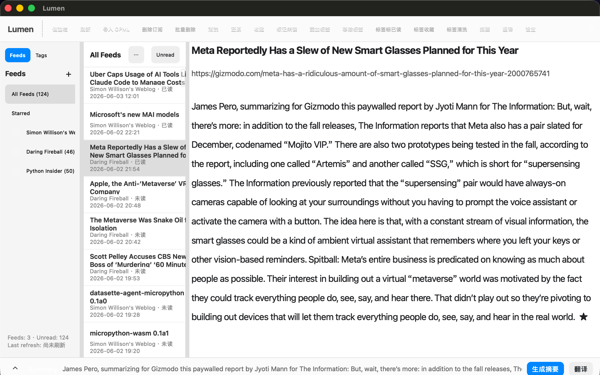
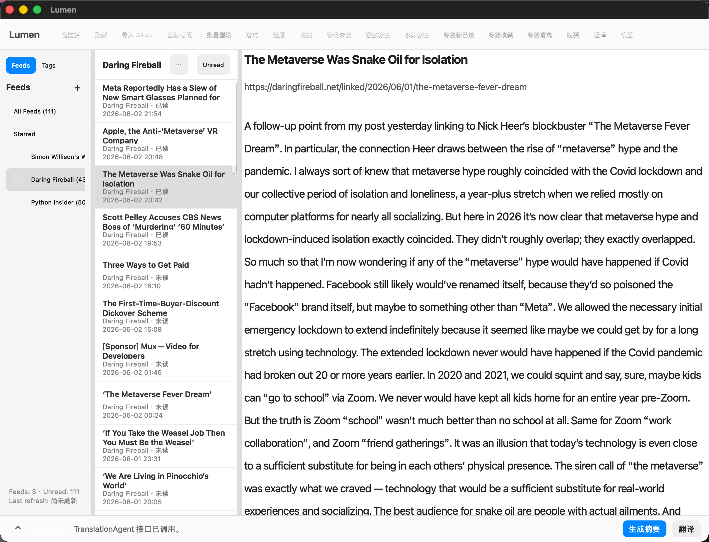
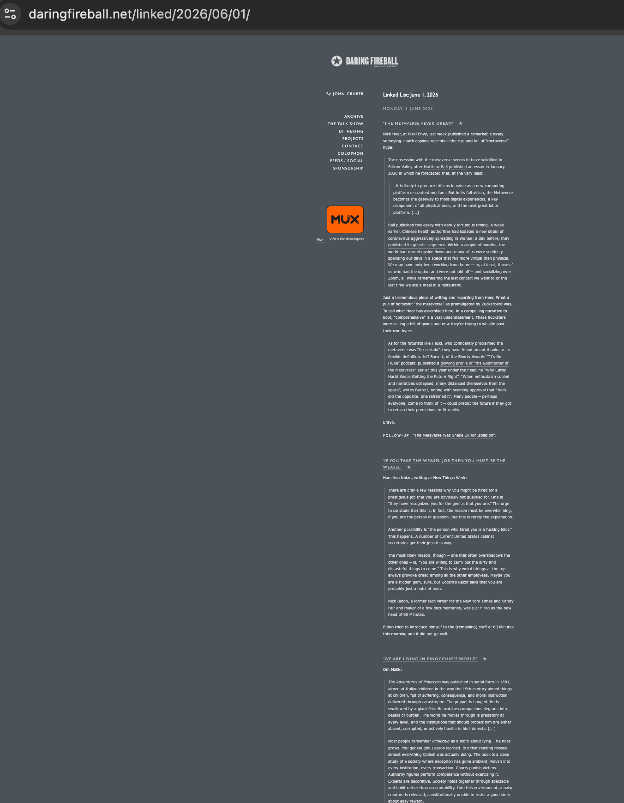

# Lumen / Mercury PyQt Edition macOS 测试报告

测试日期：2026-06-04  
测试人员：张洳维  
测试环境：macOS / `softvenv` / Python 3.14.4  
项目路径：`/Users/rrruuu/school/ecnu/class/openSoft/project`

## 1. 测试范围

本次测试覆盖当前已完成并已提交的 macOS 分组测试范围：

1. Feed / OPML：RSS、Atom、OPML、HTML feed discovery、缓存与错误隔离。
2. Reader Pipeline：fetch redirect、HTML 清洗、Markdown 转换、ReaderDocument 构建。
3. GUI smoke：PySide6 离屏实例化、三栏布局、工具栏、Reader、FeedList、ArticleList、搜索过滤。
4. Storage：SQLite migrations、Store CRUD、StorageService 接口、Reader 缓存、订阅状态和标签相关行为。
5. Storage 无 Qt 依赖隔离测试：验证 `mercury_storage.py` 不依赖 PySide6 / PyQt。

未在本分组中覆盖：

1. 真实 LLM Summary / Translation 功能。

## 2. 环境检查

执行命令：

```bash
softvenv/bin/python --version
softvenv/bin/python -m pip check
```

结果：

```text
Python 3.14.4
No broken requirements found.
```

说明：

1. `pip check` 通过。
2. `pip` 提示用户缓存目录不可写，因此禁用了 pip cache；该警告不影响当前测试。
3. `yoyo-migrations` 仍提示 `pkg_resources` deprecated，这是当前依赖兼容性风险，已在测试计划中记录。

## 3. 自动化测试结果

执行命令：

```bash
QT_QPA_PLATFORM=offscreen softvenv/bin/python -m pytest tests/test_feed_sync.py tests/test_feed_parsing.py tests/test_reader_pipeline.py tests/test_gui_smoke.py -q
```

结果：

```text
21 passed, 1 warning in 0.35s
```

警告：

```text
yoyo/migrations.py: pkg_resources is deprecated as an API.
```

结论：Feed / Reader / GUI smoke 分组测试通过。

## 4. Storage 测试结果

### 4.1 Storage 功能测试

执行命令：

```bash
softvenv/bin/python -m pytest tests/test_storage.py -q -k 'not test_no_qt_import'
```

结果：

```text
37 passed, 1 deselected, 1055 warnings in 0.68s
```

覆盖内容：

1. SQLite migrations 创建全部业务表。
2. migrations 幂等执行。
3. `FeedStore` upsert / list / get / delete。
4. `EntryStore` upsert / filter / read / starred / tag / cascade delete。
5. `ContentStore` save / get / overwrite。
6. `SettingsStore` default / get / set / overwrite。
7. `StorageService` GUI 所需接口。
8. ReaderDocument 缓存读取和保存。
9. stable id / URL 去重相关行为。

主要 warning：

1. `yoyo` 使用 deprecated `pkg_resources`。
2. Python 3.14 下 `datetime.utcnow()` 和 sqlite3 默认 datetime adapter 产生 deprecation warnings。

结论：Storage 功能测试通过；warning 属于依赖兼容性和 Python 3.14 弃用提示，不影响当前测试断言。

### 4.2 Storage 无 Qt 依赖隔离测试

执行命令：

```bash
PYTEST_DISABLE_PLUGIN_AUTOLOAD=1 softvenv/bin/python -m pytest tests/test_storage.py::test_no_qt_import -q
```

结果：

```text
1 passed, 1 warning in 0.15s
```

说明：

1. 该测试必须禁用 pytest 插件自动加载，否则 `pytest-qt` 会在测试会话中导入 PySide6，污染 `sys.modules`。
2. 隔离执行结果证明 `mercury_storage.py` 本身没有引入 Qt 模块。

结论：Storage 无 Qt 依赖隔离测试通过。

## 5. 真实订阅数据导入


当前订阅源：

| Feed | URL |
|---|---|
| Simon Willison's Weblog | `https://simonwillison.net/atom/everything/` |
| Daring Fireball | `https://daringfireball.net/feeds/main` |
| Python Insider | `https://blog.python.org/feeds/posts/default` |

抽样文章链接：

| Title | URL |
|---|---|
| Uber Caps Usage of AI Tools Like Claude Code to Manage Costs | `https://simonwillison.net/2026/Jun/3/uber-caps-usage/#atom-everything` |
| Microsoft's new MAI models | `https://simonwillison.net/2026/Jun/2/microsofts-new-models/#atom-everything` |
| Apple, the Anti-‘Metaverse’ VR Company | `https://daringfireball.net/2025/12/meta_says_fuck_that_metaverse_shit` |
| datasette-agent-micropython 0.1a0 | `https://simonwillison.net/2026/Jun/2/datasette-agent-micropython/#atom-everything` |

GUI 真实启动命令：

```bash
softvenv/bin/python mercury_gui.py
```

预期：

1. 窗口标题为 `Lumen`。
2. 左侧显示真实订阅源。
3. 中间文章列表显示真实文章。
4. 点击“查看原文”时跳转到真实网站 URL，不再跳转到 `demo.local`。

手工测试截图：




https://daringfireball.net/linked/2026/06/01/


实际结果：

1. GUI 可以启动，并且左侧可以看到真实订阅源和文章列表。
2. Reader 区域未能正确读取链接中的完整文章正文，显示内容仍偏向 Feed 摘要或解析后的简略内容。
3. Reader 正文没有按自然段落清晰分段，阅读体验不完整。
4. 部分段落末尾出现异常符号，疑似 HTML / Markdown 转换或文本清洗阶段残留字符。
5. “查看原文”链接不支持正常跳转，无法从 Reader 内直接打开原文页面。

结论：真实订阅数据已导入，GUI 有内容可展示；但真实 GUI 手工验收发现 Reader 内容读取、段落排版、异常符号和链接跳转仍存在问题，需要后续修复。

## 6. 风险和备注

| 优先级 | 问题 | 影响 | 当前处理 |
|---|---|---|---|
| P1 | `QT_QPA_PLATFORM=offscreen` 必须在 pytest 创建 QApplication 前设置 | 否则 macOS 下 GUI smoke 可能 abort | 测试命令显式设置环境变量，`test_gui_smoke.py` 也在模块导入阶段设置 |
| P1 | `test_no_qt_import` 必须隔离执行 | 与 pytest-qt 同进程运行会出现假失败 | 使用 `PYTEST_DISABLE_PLUGIN_AUTOLOAD=1` 单独执行，结果通过 |
| P2 | `yoyo` 使用 deprecated `pkg_resources` | Python 3.14 下有 warning | 当前不影响测试通过；后续可评估升级或替换 migration 方案 |
| P2 | Python 3.14 下 yoyo / sqlite3 有大量 deprecation warnings | 测试输出 warning 数量较多，影响报告观感 | 如实记录；当前断言均通过，后续可考虑 Python 3.11/3.12 或升级迁移工具 |
| P2 | 真实订阅依赖外网 | 网络不可用时刷新可能失败 | 本次已成功导入数据到本地 SQLite，GUI 启动可离线查看已导入文章列表 |
| P2 | Reader 未正确读取链接中的完整文章 | GUI 展示内容不完整，影响真实阅读体验 | 已在本报告如实记录，后续需要检查清洗按钮、ReaderPipeline 和缓存展示链路 |
| P2 | Reader 正文未分段且段末有异常符号 | 影响文章可读性和汇报展示效果 | 已在本报告如实记录，后续需要检查 HTML 到 Markdown / Reader HTML 渲染 |
| P2 | “查看原文”链接不支持跳转 | 用户无法从 Reader 直接打开原文 | 已在本报告如实记录，后续需要检查 QTextBrowser 链接处理或外部浏览器打开逻辑 |
| P3 | AI 摘要 / 翻译仍为占位 | 不能作为真实 AI 功能验收 | 报告中不将其列入已完成测试范围 |

## 7. 总体结论

本轮 macOS Feed / Reader / GUI smoke 分组自动化测试通过：

```text
21 passed
```

Storage 功能测试通过：

```text
37 passed, 1 deselected
```

Storage 无 Qt 依赖隔离测试通过：

```text
1 passed
```

真实 GUI 手工测试显示，当前应用已经可以启动并展示真实订阅数据，但 Reader 真实阅读链路仍存在明显问题：未正确读取链接中的完整文章、正文未清晰分段、段末出现异常符号，并且“查看原文”链接不能正常跳转。因此，本轮结论应区分为：

1. 自动化 smoke 测试通过。
2. Storage 自动化测试通过。
3. Storage 无 Qt 依赖隔离测试通过。
4. 真实 GUI 内容展示仍未达到完整验收标准。
